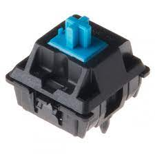
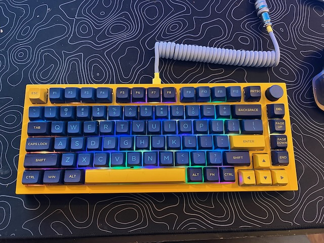
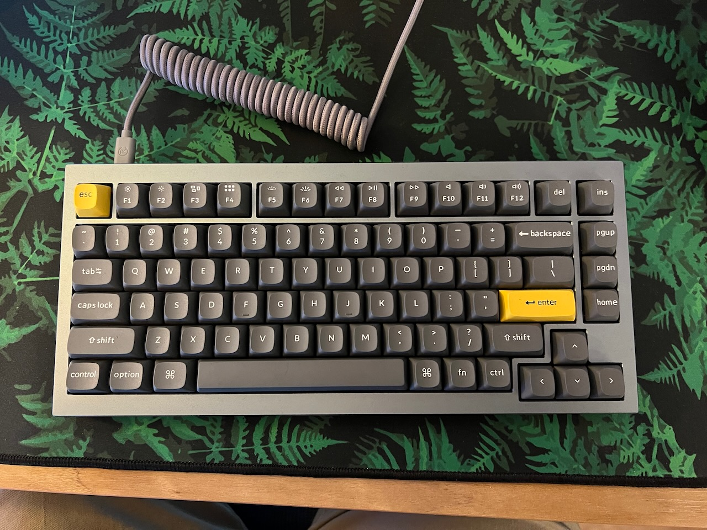

 I'm really into mechanical keyboards.  It began when I found an old IBM Model M with buckling springs.  It was loud as hell, and I named it **Ol' Clacky.**
 There's a noticable difference when typing on a mechanical keyboard versus the rubber-dome type keyboard that came bundled with your old Dell at work.

 
 Behold the beauty!

 Most modern mechanical keyboards don't use the old buckling spring mechanism that the Model M used, most use a variety of modern switches based on the Cherry MX.

Now, there are about a billion vendors that make MX-style switches, and every vendor makes an array of switches with different properties, but the most common are **Tactile, Linear, and Quiet Tactile.**  For MX style switches these are MX Blue (tactile), MX Red (linear), and MX Brown (quiet).

Keyboards can be quite the rabbit hole, if you decide to look into them.  And as with any hobby, it can get as expensive as you like.

I prefer ready-made boards, but there is a huge community of people that build them from the case up.  I don't have time for all that. :smile:

Right now I'm using a [GMMK Pro from Glorious](https://www.pcgamingrace.com/products/glorious-gmmk-pro-75-barebone-black), and a [Q1 from Keychron](https://www.keychron.com/products/keychron-q1)

GMMK Pro with a yellow top plate and some PBT keycaps I got off AliExpress:

Q1 with some PBT keycaps that also came from Keychron.  Really liking this board these days.

