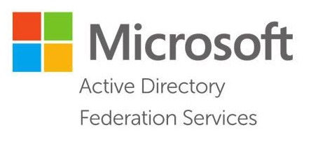

# Enable ADFS Debug Logs for all your ADFS Servers

The ADFS Admin log is pretty good for a high-level overview of what's going on with your ADFS server, but any troubleshooting needs the ADFS Debug log.  Once you get it [enabled](https://docs.microsoft.com/en-us/windows-server/identity/ad-fs/troubleshooting/ad-fs-tshoot-logging#trace-log), increase the default size and set it to archive rather than roll over.  The Debug log catches a ton of events, so I find that kicking it on right before you fire the event you are troubleshooting and then disabling it quickly helps keep the log a manageable size when it's time to export the events and view them as a saved log.

## The Whole Farm

Enabling the log in the GUI is fine if you have two or three ADFS servers, but if you have a lot of ADFS servers, you'll want to enable the log on all of them using PowerShell.  

:::tip
If your farm uses WID, I'd run this script on the primary server.  If your farm uses SQL, run it on whichever you like.
I don't have any particular reason for running it on the primary other than that's probably the server you log into the most often.
:::

```powershell
$servers = Get-Content 'C:\Temp\ADFS Hostnames.txt'

foreach ($server in $servers) {

    Invoke-Command -ComputerName $server -ScriptBlock {

        $logName = 'AD FS Tracing/Debug'
        $log = New-Object System.Diagnostics.Eventing.Reader.EventLogConfiguration $logName
        $log.IsEnabled = $true
        $log.SaveChanges()
        Write-Host "ADFS Debug Log Enabled on $($Env:COMPUTERNAME)"
    }
}
```

:::info Get-ADComputer
You can use several methods to get the servers into a variable, I would probably use `Get-ADComputer` and filter by OU in a production script.
:::

The logs are running now, have your user try to log in (or whatever the issue is) and then disable the logs.

```powershell
$servers = Get-Content 'C:\Temp\ADFS Hostnames.txt'

foreach ($server in $servers) {

    Invoke-Command -ComputerName $server -ScriptBlock {

        $logName = 'AD FS Tracing/Debug'
        $log = New-Object System.Diagnostics.Eventing.Reader.EventLogConfiguration $logName
        $log.IsEnabled = $false
        $log.SaveChanges()
        Write-Host "ADFS Debug Log Disabled on $($Env:COMPUTERNAME)"
    }
}
```

The same script with a couple changes disables the log on all servers. Now the real fun begins, digging through the logs.  You have your Correlation ID, right?  

:::tip
You can use `Get-EventLog -LogName AD FS Tracing/Debug -AfterTime '2020-01-01' -FilterByCorrelationId $correlationId` to get the log entries for that correlation ID.
:::
